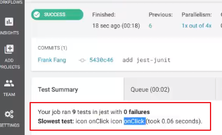

## 关于jest-junit
jest-junit 是报告测试结果的，不是coverage结果

ci运行后如果想生成TestSummary，需要这个库，具体配置参考提交："集成ci"



`JEST_JUNIT_OUTPUT=./test-results/jest/results.xml jest`package.json中脚本的这个配置参数是定死的，就是要这个约定的路径，ci才读的到

## 关于jest测试用例执行顺序
jest --runInBand 可以顺序执行所有用例,默认所有用例是并行执行的

## 将覆盖测试push到指定仓库
```
test:
    <<: *defaults
    steps:
      - checkout
      - attach_workspace: # 把之前保存的代码挪过来
          at: .
      - run: npm run ci
      - run: cd coverage
      - run: git init
      - run: git remote set-url origin xxx
      - run: get add .
      - run: git commit -m 'update'
      - run: git push
      - store_test_results:
          path: test-results
```
